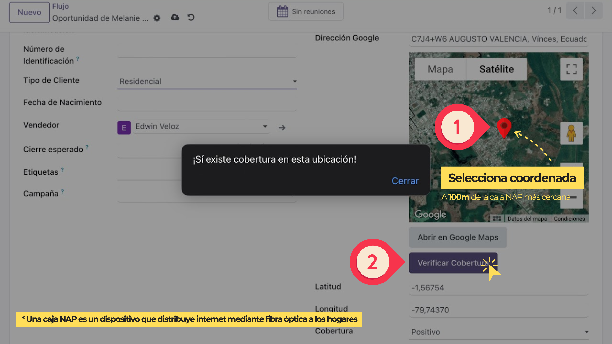

# ISP Coverage Validation Microservice


## Overview
This microservice is designed to validate if a specific geographic location (latitude and longitude) falls within the coverage area of an ISP's infrastructure. Built with **FastAPI**, it uses advanced spatial analysis techniques and integrates seamlessly with other systems such as ERPs and chatbots.

## Key Features
- Accepts geographic coordinates (lat, lon) as input.
- Parses and analyzes `.kml` files to extract:
  - Locations of NAP boxes.
  - Urban and rural area boundaries.
- Generates coverage areas based on proximity to NAP boxes:
  - 150m for urban zones.
  - 200m for rural zones.
- Performs spatial intersections using **GeoPandas**.
- Integration-ready for systems like ERPs and chatbots.

## Workflow
1. **Input**: Geographic coordinates are sent to the microservice.
2. **File Parsing**: The `.kml` file is processed to extract NAP box points and area polygons.
3. **Spatial Analysis**: The system:
   - Converts coordinates to a common CRS (EPSG:3857).
   - Checks if the input coordinate intersects with coverage areas.
4. **Output**: Returns whether the location is within coverage.

## Integration Example
### ERP Integration
The microservice integrates with ERPs, such as **Odoo**, to provide users with a map-based interface to check coverage:



- Users select their location on a map powered by Google Maps.
- The system sends the coordinates to the microservice for validation.

## Prerequisites
- Python 3.8+
- Libraries: FastAPI, GeoPandas, Shapely, lxml
- Tools: Google Earth Pro (to create `.kml` files)

## Setup Instructions
1. Clone the repository:
   ```bash
   git clone https://github.com/edwin06111998/ms-core-coverage.git
   cd ms-core-coverage
   ```

2. Install dependencies:
   ```bash
   pip install -r requirements.txt
   ```

3. Add the `.kml` file:
   Place your `.kml` file in the project root directory at `./data/map.kml`.


4. Run the server:
   ```bash
   python3 main.py
   ```

## Example KML Visualization
The system uses `.kml` files to define NAP box locations and area boundaries:


- Points represent NAP boxes.
- Polygons define urban and rural zones.

## Future Enhancements
- Integration with chatbots to validate coverage via messaging platforms like WhatsApp.
- Dynamic adjustment of coverage radii based on network conditions.

## Contributing
Contributions are welcome! Please submit a pull request or create an issue for any improvements or features you'd like to see.

## Contact
For questions or feedback, feel free to reach out:
- **Email**: edwin06111998@gmail.com
- **GitHub**: [edwin06111998](https://github.com/edwin06111998)